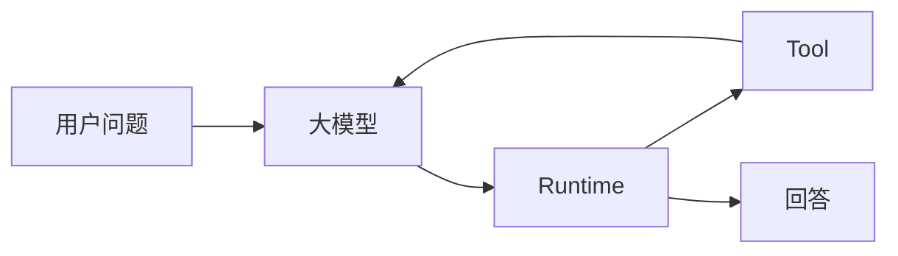

# 别再让模型当状态机：一次 Agent 协议减负实践
现在还有哪位前端不想做一个自己的 agent 呢？

现在买基金这么火，为了更深入的了解agent,为了投资理财争取早日退休，为了..我开始开发了一个研究我的基金持仓的 agent。于是开始了我一个星期烧 30 亿 token 的日子。

在这里我分享一次我的交学费的经历。

在一次重构 Agent 后，我确定了一件事：

> **运行时已经知道的，不要再让模型维护。**

但这条原则必须和另一条一起使用：

> **运行时不知道的，不要因为能写规则，就假装它知道。**

前者删除模型维护的状态镜像，

后者阻止运行时越界成为语义裁判。

本文讨论的不是让系统少存状态。

恰恰相反，主机仍应严格持有持久化状态。

要删除的是模型对这些客观系统事实的重复描述。

主线可以概括为：

> **运行时维护客观系统事实，模型负责语义理解和下一步提议。**

---

## 一个严肃 Agent 里有两类复杂度

这里的场景是个人投资研究 Agent。

它可以读取授权范围内的组合、材料和公开资料，

形成研究结论，

但不能由模型直接执行投资操作。

一次简化流程是：

```text
用户提出问题
→ 模型判断下一步需要什么信息
→ 运行时按权限执行工具调用
→ 模型根据工具结果继续研究或形成表达
→ 运行时校验客观边界并发布或结束
```

这类任务同时有两种复杂度。

第一种是语义复杂度：

```text
用户真正关心什么
下一步最值得查什么
资料是否互相矛盾
是否需要澄清或补查
结论怎样解释
```

第二种是系统复杂度：

```text
工具是否存在且获准
调用是否真正执行
结果是否真实返回并落库
引用是否仍在当前范围内
发布是否已经提交
本次运行是否已进入终态
```

两者不能因为都很复杂就交给同一方。

运行时（Runtime）是主机持有的执行与状态层。

它负责授权、工具执行、持久化、证据和数值权威、恢复、发布与终态。

模型（Model）负责理解、调查、比较、提出下一步和表达。




图中的箭头不表示模型拥有运行时状态。

模型看到的是当前允许它使用的工具和已返回的结果。

主机保存的是实际发生过的调用、结果和状态迁移。

---

## `AgentTurn` 为什么会变成认知税

早期 Agent 往往从很轻的路径开始：

```text
用户 → 模型 → 回答
```

接入工具、审计和恢复后，

系统自然会想知道模型这一轮计划做什么、缺什么、能否结束。

于是出现结构化的 `AgentTurn`：

```json
{
  "actions": ["search"],
  "gaps": ["还缺来源"],
  "completionClaim": false
}
```

它在早期并非错误。

运行时可以校验动作、记录回合并据此继续执行。

问题在于协议常常持续膨胀。

随着可靠性要求增加，

状态、缺口、权限、工具列表、发布状态和完成声明都会进入模型输出。

模型于是同时做两件事：

```text
理解和研究
+
维护系统状态
```

后者往往只是状态镜像。

例如运行时已知某项能力是否获批、某次调用是否成功、发布是否提交、运行是否结束。

如果模型还在每一轮重复输出这些信息，

系统里就有两份状态：

```text
模型描述的状态
运行时真实的状态
```

两者冲突时，最终只能以运行时为准。

因此模型那一份不是权威，

却仍需生成、解析、校验和纠错。

这就是认知税。

它至少带来三个问题：

1. 镜像会漂移：运行时拒绝了权限，模型历史却仍认为工具可用。
2. 模型注意力被协议一致性占用，而非下一步研究。
3. 任一字段失配都可能把局部问题升级为整轮重试。

字段少不等于模型一定更聪明。

更准确的判断是：

> **只有承载模型独有语义信息的字段，才值得进入模型协议。**

复杂字段还会提高组合输出正确的难度。

若把每个字段 95% 的正确率和字段间独立视为**假设示例**，

二十个字段同时正确的概率是 `0.95^20≈35.8%`。

这不是项目实测，

也不是对任何模型可靠性的结论。

它只说明：协议字段越多，越应谨慎要求模型承担彼此关联的系统状态。

### 谁拥有事实，谁维护事实

模型应该负责：

```text
用户到底想解决什么
下一步最值得查什么
搜索词如何组织
资料是否冲突
是否值得继续调查
如何解释结论
```

运行时应该负责：

```text
工具是否存在且获准
调用是否实际发生
工具结果是否返回并落库
发布是否实际提交
引用是否属于当前范围
预算和运行状态是否允许继续
```

前者需要开放语义判断。

后者是系统可以证明的客观事实。

所以原则是：

> **谁拥有事实，谁维护事实。**

模型不是数据库，

也不是权限系统。

---

## 从完整回合描述到原生工具调用

旧路径是：

```text
模型
→ AgentTurn JSON
→ 运行时解读整轮状态
```

更合适的路径是：

```text
模型
→ 原生工具调用
→ 主机固化 ModelTurn
→ 运行时执行
→ 工具结果
→ 模型
```

变化不只是在接口层使用工具调用。

关键在于模型不再描述“系统现在完整是什么状态”。

它只提出下一步的语义动作。

例如模型可以先调用：

```text
search(...)
```

读取结果后再调用：

```text
read(...)
```

或者在满足发布条件时调用：

```text
publish(...)
```

研究结束时提出：

```text
finish()
```

协议从“请描述你的完整工作流状态”，

缩为“请做你认为合理的下一步”。

### 删除 `AgentTurn` 不等于删除 `ModelTurn`

删除的是模型生成并维护的整轮状态协议。

没有删除主机持有的、持久化的 `ModelTurn` 边界。

模型一次完整响应闭合后，

主机仍需记录：

```text
本轮 ModelTurn 的内容
提出了哪些调用
调用的顺序
哪些调用已经执行
哪些结果已经落库
每次执行的回执
```

因此：

```text
模型不维护状态
≠
系统不维护状态
```

系统状态反而应更严格。

恢复依赖的是实际发生过、已落库的事实，

不是模型上次声称发生过什么。

---

## `finish()` 是结束提议，不是模型设置终态

旧协议中的：

```text
completionClaim = true
```

很容易被误解为模型宣布任务完成。

更清晰的含义是让模型调用：

```text
finish()
```

它只表示：

> **模型认为语义上的研究可以结束。**

这是一项提议，

不是写入终态的权限。

运行时随后执行终态门控，

只检查它能客观验证的条件：

```text
是否已有正式输出
当前引用是否仍有效
是否存在未结算调用
当前运行是否允许进入终态
```

运行时不应据此判断：

```text
用户的问题是否回答得足够完整
风险是否讲得足够多
反例是否已经调查充分
```

这些是开放语义判断，

不是运行时持有的事实。

因此终态门控应当严格，

但不冒充全知的语义裁判。

它可以拒绝一个客观上不能安全结束的运行，

不能借“完成检查”替模型判断答案好不好。

---

## 权限、工具可见性与能力边界

动态能力是运行时职责最清楚的例子。

假设模型当前只能看到基础工具，

却在同一响应中提出：

```text
1. 申请文档能力
2. 询问用户更多信息
```

运行时执行第一项后批准了文档能力。

下一轮可见工具可能新增：

```text
search_document
read_document
```

此时第二项旧动作不应继续跨越边界执行。

原因不是运行时认为“询问用户”在语义上不合适。

而是一个可验证的客观事实：

```text
旧工具契约 ≠ 新工具契约
```

能力获批意味着工具契约改变。

所以运行时应执行确定性的边界：

```text
能力获批
→ 工具契约变化
→ 当前响应后续动作不再执行
→ 开启下一 ModelTurn
→ 模型在新工具集合下重新决定下一步
```

旧契约下提出的动作不得跨过新契约边界。

这保护的是调用产生时的权限与工具作用域，

不是预先规定模型下一步该搜索还是该追问。

工具可见性也应按同样方式分工。

运行时根据当前用户权限、任务限制、数据源状态和已批准能力，

派生本轮真实可见的工具集合。

模型无需维护一份 `availableTools` 状态镜像。

下一次请求直接得到真实的 `tools[]` 即可。

三个概念应明确分开：

```text
权限 → 运行时持有
工具可见性 → 运行时派生
工具选择 → 模型决定
```

这既避免镜像漂移，

也使权限变化成为清晰的工具契约边界。

---

## 局部错误只应产生局部结果

重型回合协议常见的问题是：

```text
一个字段无效
→ 整个 AgentTurn 无效
→ 修复
→ 重新生成完整协议
```

但工具调用往往可以分别判断。

例如：

```text
调用 A 正确
调用 B 参数错误
```

更合理的执行方式是：

```text
A 正常执行并持久化结果
B 返回安全、可归属的错误结果
开启下一 ModelTurn
模型自行决定是否修正 B
```

这里仍允许修复，

但修复是模型面对工具结果后的普通推理。

它不是运行时隐藏的第二套整轮协议。

局部错误隔离避免为了修一个参数，

重新生成整份世界状态。

---


## 历史压缩也不能改写主机事实

同样的原则也适用于历史压缩。模型可以摘要过去的回答，但用户原始约束不应被摘要模型改写后再当作系统事实。Runtime 已经保存了原始输入，就应该决定保留或省略，而不是把事实所有权转交给另一个模型。

---

## 四阶段演进

| 阶段 | 形态 | 得失 |
| --- | --- | --- |
| 提示式 Agent | 用户 → 模型 → 回答 | 自然，但工程控制弱 |
| 结构化 Agent | 模型结构化输出 → 运行时 → 工具 | 获得校验、审计与恢复 |
| 重协议 Agent | 状态、权限和完成声明持续进入模型协议 | 系统完整，但状态镜像变重 |
| 原生工具调用 Agent | 模型提议调用，运行时持有事实 | 保留工程边界，删除模型状态镜像 |

最后一个阶段不是退回提示式 Agent。

它保留了持久化、审计、权限、恢复和终态门控，

只是不再要求模型维护这些系统事实。

---

## 运行时不应把一切写成规则

所有权重划后，很容易滑向另一个极端：

既然运行时可靠，是否应把所有判断都规则化？

答案是否定的。

以下问题即使可以被编码，

也不因此成为运行时客观知道的事实：

```text
下一步最值得查什么
资料冲突时应追查哪一边
用户更关心收益还是风险
当前信息是否足以形成建议
```

代码能稳定执行，

不等于系统拥有这些语义判断的权威。

因此运行时可以强制执行显式权限、作用域、持久化、调用顺序和终态条件。

运行时不能根据自由文本的措辞，

伪装成客观规则去猜测意图、完整性、安全性或答案质量。

当语义不确定时，

应让模型表达不确定、提议澄清或继续调查，

而不是让运行时用未经授权的语义判断替代它。

这正是“严格但不全知”的含义。

---

## 外硬内软

一个更合适的 Agent 形态是外硬内软。

外层由运行时严格维护：

```text
权限、工具契约、作用域、持久化、执行回执、恢复、发布与终态
```

内层交给模型处理：

```text
理解、调查、比较、怀疑、补查与解释
```

严格的执行边界让系统诚实，

开放的语义空间让模型真正承担它擅长的工作。

---

## 代码评审的五个问题

新增模型字段或运行时状态时，可以先问：

1. 这个信息是谁真正拥有的，运行时能否唯一确定？
2. 如果运行时已经知道，为什么还要让模型输出状态镜像？
3. 该字段表达模型独有的语义判断，还是系统已经发生的事实？
4. `finish()` 是语义结束提议，还是在偷偷写入系统终态？
5. 恢复依据真实落库事实和执行回执，还是模型上次自报的状态？

若这些问题没有清楚答案，

协议通常已经开始变重或越界。

---

## 这次升级没有证明什么

架构边界更清楚，

不等于模型质量、成本、延迟或投资研究能力已经被证明。

协议字段减少也不能直接推出回答更聪明、研究更深或消耗更低。

这些结论需要真实样本和可比较评测。

这次改变直接说明的只有：

```text
哪些状态不再要求模型维护
哪些事实改由主机持有
哪些恢复不再依赖模型自报状态
哪些权限和发布边界可以客观执行
```

协议设计与产品效果必须分别证明。

---

## 最后

两条原则足以约束这类协议设计：

> **运行时已经知道的，不要让模型再维护。**

> **运行时不知道的，不要假装它知道。**

好的 Agent 架构不是消灭复杂度，

而是让运行时持有客观事实，让模型处理开放语义并提出下一步。

## 0. 导读：这篇文章回答什么

这篇文章讨论个人投资研究 Agent 中模型与运行时的协议边界：模型该承担哪些判断，系统又该保存和执行哪些事实。它不主张减少系统状态，而是删除模型对主机已知状态的重复镜像。

- **问题**：为什么 `AgentTurn` 一类整轮 JSON 容易不断膨胀，并让模型兼任工作流状态机？
- **结论**：运行时维护客观系统事实，模型负责语义理解和下一步提议；谁拥有事实，谁维护事实。
- **运行路径**：第三章说明请求如何从模型提议、原生工具调用，到运行时执行和终态门控。
- **边界**：运行时应严格执行权限、持久化和终态条件，但不能把开放语义判断伪装为客观规则。
- **验证范围**：本文只说明架构职责如何划分，不证明模型质量、成本、延迟或投资研究能力。

## 一、先建立总边界：谁拥有事实，谁负责语义

本章先区分语义问题与系统事实，给出模型、主机和运行时的基本分工；后续所有协议收缩都从这个边界出发。

### 1.1 核心判断

个人投资研究 Agent 可以在授权范围内读取组合、材料和公开资料，形成研究结论，但不能让模型直接执行投资操作。一次简化流程是“用户提问 → 模型判断下一步信息 → 运行时执行获准调用 → 模型根据结果继续研究或表达 → 运行时校验客观边界并发布或结束”。

其中有两类不能混为一谈的复杂度。模型适合处理“用户真正关心什么、下一步查什么、资料是否冲突、是否需要澄清、如何解释结论”等开放语义；系统适合处理“工具是否获准、调用是否发生、结果是否落库、引用是否在范围内、发布是否提交、运行是否终态”等可验证事实。

因此，本文的核心判断是：

> **运行时已经知道的，不要再让模型维护；运行时不知道的，也不要因为能写规则，就假装它知道。**

前一句删除模型维护的状态镜像，后一句防止运行时越界成为语义裁判。

### 1.2 三类责任：Model / Host / Runtime

本节回答三者为何不应被混作一个“系统”。模型、主机和运行时可以协作，但它们持有的权威不同。


| 角色           | 主要责任                                | 不应承担的责任           |
| ------------ | ----------------------------------- | ----------------- |
| 模型（Model）    | 理解问题、调查、比较、判断下一步、组织表达               | 维护权限、调用结果、发布状态和终态 |
| 主机（Host）     | 持久化 `ModelTurn`、调用顺序、工具结果、执行回执和发布记录 | 以模型自报状态替代真实记录     |
| 运行时（Runtime） | 在主机持有的事实上执行授权、工具调用、作用域、状态迁移、恢复和终态门控 | 判断用户意图、答案完整性或研究质量 |


这里的运行时是主机中负责执行和状态控制的部分。主机保存真正发生过的事实；运行时据此施加机械边界；模型只在可见工具和已返回结果的基础上提出下一步。

### 1.3 本文不讨论什么

本节明确范围，避免把协议设计误读为通用模型能力结论。本文讨论的是模型与运行时的事实所有权和工具协议边界，不讨论投资策略是否正确，也不讨论如何用提示词替代研究判断。

本文同样不主张把所有决策写成规则，或由模型取代持久化状态。模型的自然语言理解不能成为权限、数值、证据、发布或终态的唯一权威；反过来，运行时也不能根据自由文本猜测模型意图、答案质量或调查是否充分。

## 二、事实所有权：哪些状态必须由 Host 持有

本章回答“系统究竟应该保存什么”。要删除的是模型生成的系统状态镜像，不是主机持有的持久化状态；后者正是审计和恢复的基础。

### 2.1 运行时事实与模型提议的区别

本节区分“模型认为下一步应做什么”和“系统已经发生了什么”。前者是提议，后者必须由主机记录并由运行时验证，二者不能互相替代。

模型可以提议 `search(...)`、`read(...)`、`publish(...)` 或 `finish()`，也可以说明它想澄清什么、为何继续调查。这些是模型独有的语义判断。工具是否存在、是否授权、调用是否执行、结果是否成功写入、发布是否提交，则是运行时可以证明的事实。

因此，模型不是数据库，也不是权限系统。模型输出最多是尚待执行的提议；工具结果、状态迁移和执行回执只有在主机记录后，才成为系统事实。

### 2.2 为什么不能维护模型状态镜像

本节解释重协议的根本问题：当运行时已拥有一项事实，要求模型重复描述它，不会增加权威，只会制造第二份容易漂移的版本。

早期结构化协议常见如下形式：

```json
{
  "actions": ["search"],
  "gaps": ["还缺来源"],
  "completionClaim": false
}
```

这类 `AgentTurn` 在早期可用于表达动作和研究缺口；问题是它常逐步塞入权限、工具列表、调用结果、发布状态和完成标记。运行时已拒绝某项能力，模型历史却可能仍认为工具可用；两者不一致时，最终仍只能以运行时为准。

模型那份状态既非权威，又需要生成、解析、校验和纠错，这就是认知税。协议应只保留模型独有的语义信息，不应让模型反复维护主机已经确定的客观状态。

### 2.3 Host 持久化记录：ModelTurn、工具调用、回执、发布

本节说明去掉模型状态镜像后，主机反而要更严格地保存哪些记录。持久化边界由主机建立，模型不需要也无权自己声明这些记录已经发生。

下面的 JSON 是主机持有的回合记录示例，不是要求模型返回的整轮状态协议。顶层 `ModelTurn` 固化一次响应；调用数组记录提议与执行顺序；每个调用的工具结果和执行回执独立落库；发布记录单独表达是否实际提交。

```json
{
  "modelTurn": "turn-17",
  "toolCalls": [
    {
      "id": "call-1",
      "name": "search",
      "status": "completed",
      "resultRef": "result-1",
      "receiptRef": "receipt-1"
    }
  ],
  "publication": {
    "status": "completed",
    "receiptRef": "publication-receipt-1"
  }
}
```

这意味着“模型不维护状态”不等于“系统不维护状态”。恢复所依赖的是实际发生过、已落库的 `ModelTurn`、调用、结果、回执与发布记录，而不是模型上次声称发生过什么。

## 三、一次请求如何运行：从 AgentTurn 到原生工具调用

本章把职责边界放进一次请求的时序中。协议的目标不再是让模型描述完整工作流状态，而是让模型以当前上下文提出一个可验证的下一步。

### 3.1 请求输入与 ModelTurn 提议

本节回答模型在一轮中实际收到什么、输出什么。模型应接收用户问题、此前可用的工具结果和本轮真实可见的工具，而不是被要求复述系统完整状态。

旧路径通常是“模型 → `AgentTurn` JSON → 运行时解读整轮状态”。更合适的路径是“模型 → 原生工具调用 → 主机固化 `ModelTurn` → 运行时执行 → 工具结果 → 模型”。模型先调用 `search(...)`，读到结果后可调用 `read(...)`，需要发布时提出 `publish(...)`，研究结束时提出 `finish()`。

原生工具调用把协议从“请描述完整工作流状态”缩为“请做你认为合理的下一步”。主机仍保存该次 `ModelTurn` 与调用顺序，但模型不再维护调用是否已经真实执行。

### 3.2 工具可见性与能力边界

本节回答能力变化为何需要中断旧动作。能力获批、撤销或数据源状态变化会改变工具契约；这是运行时可验证的边界，而不是模型语义判断。

例如模型在同一响应中先申请文档能力，再提议询问用户。运行时批准能力后，下一轮可能新增 `search_document` 与 `read_document`。此时旧响应中后续动作不应继续跨越边界执行，因为旧工具契约已经不同于新工具契约。

运行时应执行“能力获批 → 工具契约变化 → 当前响应后续动作停止 → 开启下一 `ModelTurn` → 模型在新工具集合下重新决定”的流程。它保护调用产生时的权限与作用域，不是在决定模型接下来应搜索还是追问。

### 3.3 工具选择权在模型，工具授权权在 Runtime

本节将三个容易混淆的概念拆开。运行时依据用户权限、任务限制、数据源状态和获批能力派生工具可见性；模型在当前可见工具中选择下一步；主机记录实际调用与结果。

可以将其写成：

```text
权限 → 运行时持有
工具可见性 → 运行时派生
工具选择 → 模型决定
```

所以模型不应维护 `availableTools` 镜像。下一次请求直接得到真实的 `tools[]`，比让模型猜测或回写工具状态更一致。

### 3.4 `finish()` 只是语义完成提议

本节回答“结束”由谁决定。`finish()` 表示模型认为语义上的研究可以结束，不是模型写入系统终态的权限；旧协议中的 `completionClaim` 也不应被当作完成事实。

运行时随后执行终态门控，只检查可客观验证的条件：是否已有正式输出、当前引用是否有效、是否存在未结算调用，以及当前运行是否允许进入终态。它可以拒绝一个客观上无法安全结束的运行，但不能借完成检查判断答案是否足够完整、风险是否讲够或反例是否研究充分。

完整流程如下。图中模型提出调用，运行时执行客观边界并保存事实；工具结果回到模型支持下一步语义判断，终态只能在运行时门控后成立。

```mermaid
flowchart LR
    U[用户问题与已保存上下文] --> M[模型：理解并提出下一步]
    M --> H[主机：固化 ModelTurn]
    H --> R[运行时：授权、作用域与执行]
    R --> T[工具结果与执行回执]
    T --> M
    M --> F[finish() 语义结束提议]
    F --> G[运行时终态门控]
    G --> P[发布或终态]
```


## 四、协议为什么要克制：减少字段、减少认知税

本章回答协议为何不应随着可靠性诉求无限增长。可靠性来自主机保存真实事实并严格执行边界，而不是让模型在每轮填写更多控制字段。

### 4.1 字段越多，失败面越大

本节说明复杂协议的组合风险，但不把示例误作项目指标。字段越多，模型越需要同时满足彼此关联的格式、状态和条件；一个不相关字段的失配也可能使整轮无法被接受。

若把每个字段 95% 的正确率与字段之间独立视为**字段独立性假设示例，不是实测指标**，二十个字段同时正确的概率为 `0.95^20≈35.8%`。这不是任何项目、模型或运行的成功率结论，只说明应避免将大量系统状态打包成必须一次全部正确的模型输出。

### 4.2 不把控制字段塞进模型协议

本节回答哪些字段不该进入模型协议。权限、工具可见性、调用是否成功、结果是否落库、发布状态、预算和终态都由运行时或主机确定；把它们塞进模型输出只会形成可漂移的状态镜像。

模型协议应表达它独有的语义：想做什么调用、为何继续研究、是否提出澄清、怎样解释结论。运行时事实则通过工具结果、执行回执和持久化记录提供给后续回合，而非要求模型重新声明。

### 4.3 结构化输出的最小原则

本节给出协议收缩的判断标准。结构化输出不是错误，但每个字段都应回答：删除它后，模型究竟失去了哪项独有的语义表达？

如果字段只是主机已知事实的副本，就应从模型协议移除；如果字段承载下一步提议所必需的参数，则保留并按工具契约校验。最小原则不是追求字段越少越好，而是避免把运行时控制面伪装成模型认知面。

## 五、运行时如何保持严格但不过度规则化

本章回答运行时为何既要严格又不能全知。它必须机械地保护客观边界，但不应从自由文本中推断开放语义并据此冒充权威。

### 5.1 必须机械阻断的事实

本节列出运行时应直接执行的事实边界。这些条件可以由主机记录或明确的输入契约证明，因此无需、也不应交由模型确认。

运行时应阻断未授权工具、越出作用域的调用、跨越工具契约边界的旧动作、无效的结构化参数、重复或未结算的执行、未持久化的发布，以及不满足客观条件的终态迁移。它也应保存调用顺序、状态迁移和执行回执，为审计与恢复提供事实链。

### 5.2 不能由 Runtime 冒充语义裁判的判断

本节说明“能编码”不等于“客观知道”。下一步最值得查什么、冲突资料应追哪一边、用户更关心收益还是风险、信息是否足以形成建议，都属于模型需要处理的语义判断。

运行时不能根据自由文本的措辞，用手写规则猜测意图、完整性、安全性或答案质量，再以此拒绝、改写或路由回答。语义不确定时，应让模型表达不确定、提议澄清或继续调查；运行时只执行已有的类型、权限、作用域和状态契约。

### 5.3 外硬内软：协议硬约束，语义留给模型/评审

本节用“外硬内软”总结前两节，而非新增一套原则。外层由运行时严格维护权限、工具契约、作用域、持久化、执行回执、恢复、发布和终态；内层由模型处理理解、调查、比较、怀疑、补查与解释。

必要时，人类评审可以评估研究质量和投资表达，但这并不把开放语义判断转化为运行时的客观事实。严格边界保护系统诚实，开放语义空间让模型承担其擅长的工作。

## 六、失败、局部错误与恢复

本章回答失败发生后怎样既不丢失事实，也不把局部问题升级为整轮重生成。核心是将工具结果、控制边界和恢复依据分别落在可验证的层级。

### 6.1 单个工具调用失败不能污染整轮

本节处理同一回合中的局部失败。重型 `AgentTurn` 常见路径是“一个字段无效 → 整轮无效 → 修复 → 重新生成完整协议”，但独立工具调用通常可以独立结算。

例如调用 A 正确、调用 B 参数错误时，运行时应执行 A 并持久化其结果，同时为 B 返回安全、可归属的错误结果；随后开启下一 `ModelTurn`，由模型决定是否修正 B。修复仍然存在，但它是模型面对真实工具结果后的普通推理，不是运行时隐藏的第二套整轮协议。

### 6.2 控制图/状态机只负责边界和恢复

本节说明去掉大 `AgentTurn` 后控制结构仍然必要。控制图负责固定 `ModelTurn → 动作运行时 → 终态门控 → 下一 ModelTurn / 结束` 等控制边界和恢复点；状态机负责 `proposed`、`running`、`partial`、`completed`、`failed`、`cancelled` 等客观迁移。

它们不应预先规定研究路径，例如强制“行业 → 财务 → 风险 → 估值 → 推荐”。前者是执行结构，后者是在替模型规定开放思考步骤。控制图固定控制边界，不固定开放思考路径。

### 6.3 恢复依赖真实落库事实

本节回答进程中断后如何继续。恢复不能依赖模型回忆或自报状态，而应查询主机已保存的事实链。

例如模型已提出工具调用，主机已持久化提议，工具执行成功且工具结果与执行回执已落库，但检查点尚未更新时进程崩溃。恢复应找到原始提议、结果和回执后继续，而不是重新问模型“刚才准备做什么”。

### 6.4 历史压缩与上下文恢复的边界

本节把同一原则用于历史。模型可以摘要过去的模型回答，但用户原始约束，例如“不联网”或“只讨论某段时间”，不能被摘要模型改写后再当作系统事实。

主机保留原始输入，并根据上下文预算决定保留或整体省略哪些内容。摘要是辅助表达，不替代主机持有的原始约束；上下文恢复同样应依据真实记录，而不是摘要后的状态镜像。

## 七、架构演进：从旧 AgentTurn 到当前边界

本章将当前设计放在演进中理解。目标不是否定结构化 Agent，而是保留其工程能力，同时删除模型维护系统状态的负担。

### 7.1 四阶段演进表

本节按四个阶段概括协议的变化，便于识别当前设计究竟舍弃了什么、继承了什么。


| 阶段           | 形态                 | 得失              |
| ------------ | ------------------ | --------------- |
| 提示式 Agent    | 用户 → 模型 → 回答       | 自然，但工程控制弱       |
| 结构化 Agent    | 模型结构化输出 → 运行时 → 工具 | 获得校验、审计与恢复      |
| 重协议 Agent    | 状态、权限、完成声明持续进入模型协议 | 系统完整，但状态镜像变重    |
| 原生工具调用 Agent | 模型提议调用，运行时持有事实     | 保留工程边界，删除模型状态镜像 |


### 7.2 哪些旧做法被删除，哪些 Host 能力被保留

本节防止把协议减负误解为能力退化。被删除的是模型生成的整轮状态描述，以及对权限、工具列表、调用结果、发布和终态的重复镜像。

被保留并强化的是主机能力：`ModelTurn` 持久化、调用顺序、工具结果、执行回执、权限和作用域校验、能力边界、发布记录、状态迁移和恢复。当前设计不是退回“用户 → 模型 → 回答”，而是让工程控制回到拥有事实的一方。

### 7.3 当前设计的已知限制

本节说明边界清晰后仍需要面对的限制。原生工具调用与持久化事实只能减少协议混乱，不能保证模型一定选择最佳研究路径，也不能代替对研究内容、证据质量和投资表达的评估。

工具契约、错误隔离和终态门控还需要由具体系统的类型设计、测试和运行记录支持。本文提出的是职责边界，不是对最终产品效果的承诺。

## 八、代码评审清单

本章将前文原则转换为新增字段、工具或状态时的快速检查。它不是通用评分表，而是用来识别模型状态镜像和运行时越界的最小清单。

1. 这个信息是谁真正拥有的，运行时能否唯一确定？
2. 如果运行时已经知道，为什么还要让模型输出状态镜像？
3. 该字段表达模型独有的语义判断，还是系统已经发生的事实？
4. `finish()` 是语义结束提议，还是在偷偷写入系统终态？
5. 恢复依据真实落库事实和执行回执，还是模型上次自报的状态？

若这些问题没有清楚答案，协议通常已经开始变重或越界。

## 九、这套设计证明什么、不证明什么

本章限制本文可作出的结论。清晰的所有权边界是架构事实，不能被直接外推为模型或产品效果。

### 9.1 可以证明的

本节列出该设计直接改变的对象：哪些状态不再要求模型维护，哪些事实由主机持有，哪些恢复不再依赖模型自报状态，以及哪些权限、发布和终态边界可以由运行时客观执行。

这些是协议与职责层面的可检查结论。它们说明系统把权威事实放在了能够持久化、审计和恢复的一方。

### 9.2 不能证明的

本节避免把架构改变包装成未验证的业务效果。协议字段减少不等于回答更聪明、研究更深、成本更低、延迟更小，也不等于投资研究能力已经提升。

模型质量、成本、延迟和投资研究能力都需要真实样本与可比较评测单独证明。协议设计和产品效果必须分开评价。

## 结语

主机应持有真实发生过的状态，运行时应在这些事实上严格执行权限、作用域、持久化和终态边界。

模型应处理无法由系统客观预先裁定的语义：理解、调查、比较、澄清和下一步提议。

好的 Agent 架构不是消灭复杂度，而是把客观系统事实留给运行时，把开放语义留给模型。